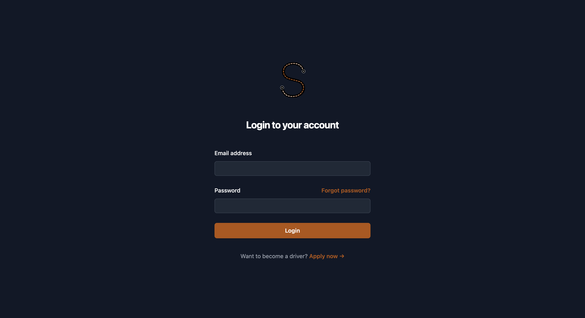
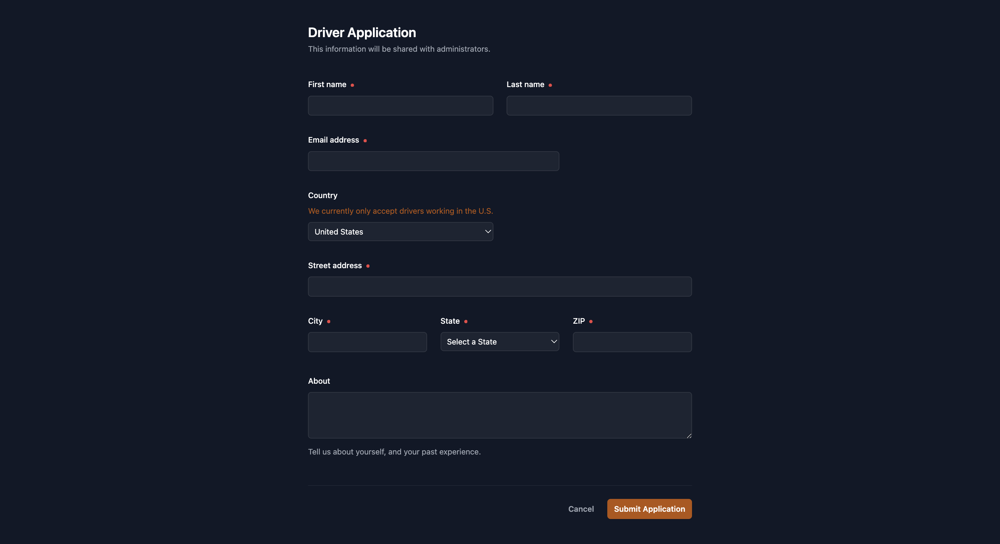
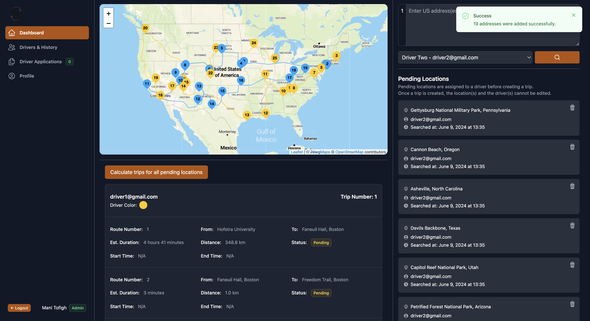
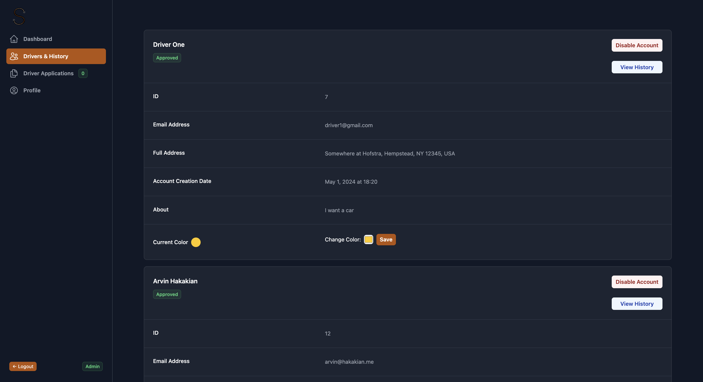
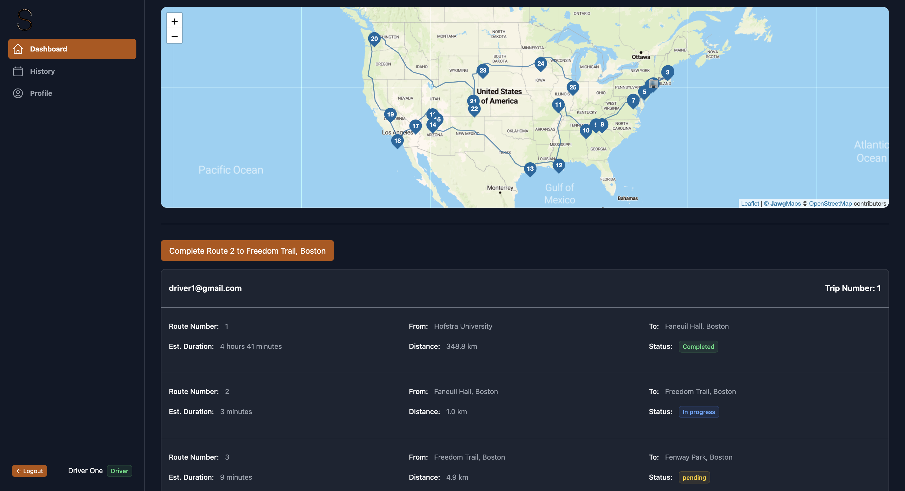
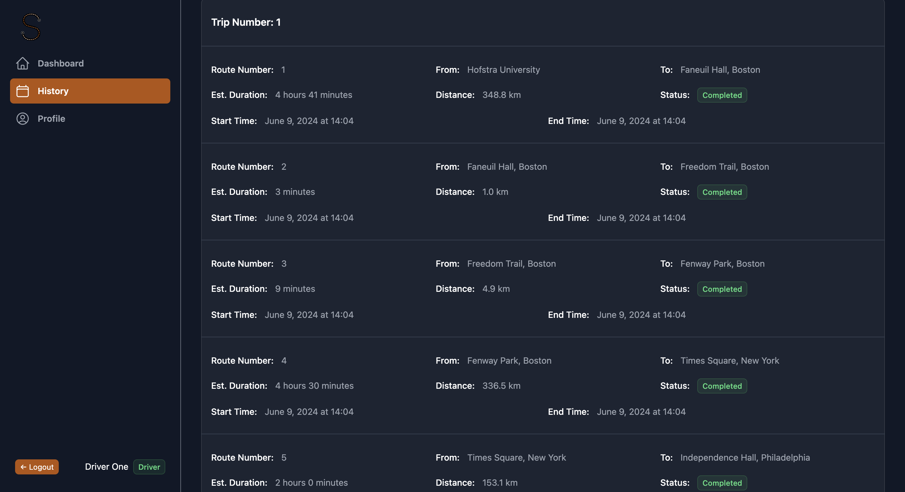
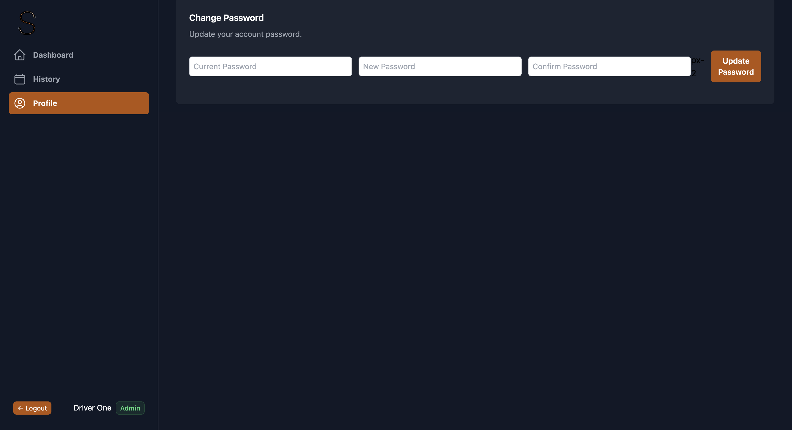

# Mapping Software | Slick

## Introduction

"Slick" is a web-based software application, aiming to help delivery organizations manage their deliveries, drivers, and driving routes more efficiently. 

Imagine a company like Fedex, UPS, or Amazon. They have a lot of drivers, a lot of packages, and a lot of delivery locations. They need delivery locations to be assigned to drivers, and they need administrators to be able to track and manage the drivers and their deliveries.
But such companies have other things to worry about, like the cost of fuel, the time it takes to deliver a package, the distance between delivery locations, etc. 
You don't want a list of addresses from orders that come in to be visited sequentially. You want the most efficient route to be calculated, so that the driver can deliver the most packages in the least amount of time, and with the least amount of fuel. 

That's what Slick does. It helps administrators input a list of delivery locations, either through manual address insertion, or through a CSV or TXT file upload for bulk insertion. Slick then calculates the most efficient route for the assigned driver to take to visit all locations. Drivers can stamp their arrival, and administrators can track the progress of the driver in real-time.

There are many other functionalities that Slick provides, such as driver registration, driver application acceptance/rejection, driver and administrator profile management, driver management for administrators, history of deliveries for drivers, etc.

## Demo
Users with access to [Hofstra University's CS VPN](https://csconnect.hofstra.edu/) can access the web app hosted on CS VMs at [this link](http://10.22.12.86:4004/). (For testing credentials please contact the authors)

Either way, here are some images of different sections of the web app:
### Login Page


### Driver Apply Page


### Admin Dashboard


### Admin Driver Management


### Admin Profile Management


### Driver Dashboard


### Driver History


### Driver Profile Management


## Setup
### 1. Clone the repository
* SSH: `git@github.com:manitofigh/mapping-software.git`
* HTTPS: `https://github.com/manitofigh/mapping-software.git`
* GitHub CLI: `gh repo clone manitofigh/mapping-software`

### 2. Navigate to the project directory
```bash
cd mapping-software
```

### 3. Install the required dependencies
```bash
npm install
```
### 4. Setup the datbase schema
We are using PostgreSQL for our database. You can download it here: https://www.postgresql.org/download/

We recommend using pgAdmin to create the database. You can download it here: https://www.pgadmin.org/download/

Of course, you can use any other database management tool you prefer, as long as it supports PostgreSQL.

After the creation of the database (e.g. you can call it "slick"), you can run the sql commands provided in the `sqlQueries.sql` file to create the required tables. You can later use the `manageDb.js` file to create some sample users and data to get started with the application (e.g. creating an admin user to be able to log in).

### 5. `.env` file setup
```bash
cp .env.sample .env
``` 

Provide the necessary information for your database connection.
The application uses nodemailer to send out emails for many functionalities (e.g. driver registration requests, application acceptances, application rejections, password resets, etc). 

The easiest thing is to use a gmail account and create an app password for the application.

You can follow the instructions here: https://knowledge.workspace.google.com/kb/how-to-create-app-passwords-000009237

### 6. Start the application
`node app.js` or `nodemon app.js` if you have nodemon installed.

## Authors
[Mani Tofigh](https://www.linkedin.com/in/manitofigh) </br>
[Sean Cotter](https://www.linkedin.com/in/theseancotter/) </br>
Josh Albin </br>
Kevin Tjon </br>
[Mohtasim Billah](https://www.linkedin.com/in/mohtasimb62/) </br>
